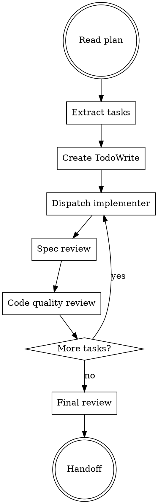

# FORGE Build

**Phase 6 of 9** - Execute implementation plan with tests already created. Use Ralph Loop to iterate until tests pass.

## Philosophy

**"Build with discipline"** - Fresh subagent per task, two-stage review, TDD enforcement, Karpathy compliance.

## When to Use

Use `/forge:build` when:
- Implementation plan exists
- Ready to execute tasks
- Want parallel subagent execution

Skip when:
- Plan not yet created (use `/forge:plan`)
- Prefer manual execution

## Build Workflow



## Subagent-Driven Development Pattern

**Core principle:** Fresh subagent per task + two-stage review = high quality

**FORGE's implementation of subagent-driven development:**

### Task Execution Loop

1. **Dispatch implementer subagent**
   - Provide full task text + context
   - Implementer asks questions if needed
   - Implements with TDD
   - Writes completion summary

2. **Spec compliance review**
   - Verify code matches plan spec
   - Check for scope creep
   - Confirm validation criteria met

3. **Code quality review**
   - Karpathy guideline compliance
   - Design patterns
   - Test coverage

4. **Iterate until approved**
   - Fix issues found
   - Re-review
   - Mark complete

## Implementer Subagent Protocol

**Completion requirements:**
1. Write code using Edit tool
2. Run tests (TDD cycle)
3. Run TypeScript check: `npx tsc --noEmit`
4. Write summary to `.claude/memory/forge/completed/{task-id}.md`
5. Stop - file write is completion signal

**TDD Requirements:**
- Write failing test FIRST (if no existing test)
- Make minimal change to pass
- Refactor while green
- No production code without failing test

## Two-Stage Review

### Stage 1: Spec Compliance

**Reviewer checks:**
- [ ] All spec requirements implemented
- [ ] No scope creep (extras not in spec)
- [ ] Validation criteria met
- [ ] File paths match plan

### Stage 2: Code Quality

**Reviewer checks (Karpathy-focused):**
- [ ] Changed lines < 50
- [ ] One logical change per edit
- [ ] No unrelated refactoring
- [ ] Tests pass with evidence
- [ ] TypeScript compiles

## Dynamic Skill Loading (Optional)

**Auto-load based on task if available:**

| Task Signal | Skills to Load (if installed) |
|-------------|------------------------------|
| `.tsx` file | `frontend-design`, `vercel-react-best-practices` |
| `animation` | `interaction-design`, `12-principles-of-animation` |
| `API` | `cloudflare-full-stack-integration` |
| `test` | `test-driven-development` |
| `fix` | `systematic-debugging` |

**Note:** These skills enhance FORGE but are not required. FORGE works standalone.

## Checkpoint Gates

**After every 3 tasks:**
- Pause for validation
- Run full test suite
- Check TypeScript
- User checkpoint (optional)

**After each file:**
- TypeScript check
- No broken imports

## Build Output

**Completed tasks logged:**
- `.claude/memory/forge/completed/{task-id}.md`

**Final output:**
- Working code (all tasks complete)
- Test coverage
- Commit history

## Integration

**Consumes:**
- `docs/forge/plan.md` (implementation tasks)
- `docs/forge/test-plan.md` (tests created in Phase 5)
- Pre-existing test suite (from `/forge:test`)

**Produces:**
- Working code that passes tests
- `.claude/memory/forge/completed/*.md`

**Hands off to:**
- `/forge:validate` - Verify against requirements

## Ralph Loop vs Subagent-Driven Build

| Approach | When to Use |
|----------|-------------|
| **Ralph Loop** | 10+ steps, overnight tasks, clearly defined tests |
| **Subagent-Driven** | < 10 tasks, interactive development, human checkpoints |

**Ralph Loop with Tests:**
```bash
/forge:ralph "Implement feature" \
  --plan docs/forge/plan.md \
  --completion-promise "MINOR GATES: Unit tests pass" \
  --final-gate "FULL GATES: E2E tests pass"
```

**Subagent-Driven:**
```
/forge:build (uses fresh subagent per task, two-stage review)
```

## Artifact Levels

| Level | Build Approach |
|-------|----------------|
| Minimal | Direct implementation, no subagents |
| Intelligent | Subagent-driven with reviews |
| Maximal | Extended reviews, multiple reviewer types |

## Success Criteria

Build is complete when:
- [ ] All plan tasks implemented
- [ ] All tests pass
- [ ] TypeScript compiles
- [ ] Spec compliance verified
- [ ] Code quality approved
- [ ] Karpathy guidelines followed
