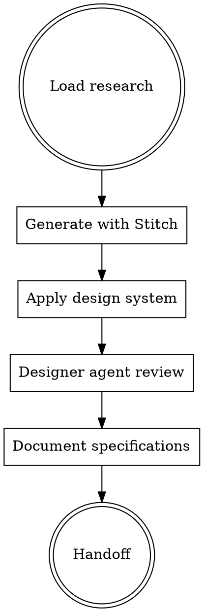

# FORGE Design

**Phase 3 of 9** - UI/UX generation with Stitch AI integration and design system compliance.

## Philosophy

**"Design with data"** - Research-informed design generation using Stitch AI, validated against design system.

## When to Use

Use `/forge:design` when:
- UI/UX specifications needed
- Visual design required
- Component structure to be defined
- User flows need documentation

Skip when:
- Backend-only change with no UI impact
- Design already specified in tickets

## Design Workflow



## Stitch Integration

**Using Stitch MCP:**
```typescript
// Generate design with Stitch
mcp__stitch__generate_screen_from_text({
  projectId: "...",
  prompt: "[Enhanced prompt from design skill]"
})
```

**Prompt enhancement:**
- Injects design system context
- Adds UX keywords
- Structures for optimal generation

## Design System Compliance

**Auto-loads:**
- `@design-system` - Project design system
- `@frontend-design` - Implementation guidance

**Validates against:**
- Color palette (paper-base, blueprint-navy, etc.)
- Typography (Source Serif 4, Inter, JetBrains Mono)
- Animation patterns (EASING.entrance, etc.)
- Component library (shadcn/ui conventions)

## Designer Agent Review

**Specialized subagent:**
- Reviews Stitch output
- Validates design system compliance
- Checks accessibility
- Suggests improvements

**Writes review to:** `.claude/memory/forge/design-review.md`

## Design Output Format

```markdown
---
date: YYYY-MM-DD
based_on: "docs/forge/research.md"
artifact_level: intelligent
stitch_screens: ["screen-id-1", "screen-id-2"]
---

# Design: [Objective]

## Design Overview
[High-level description of UI/UX approach]

## User Flows

### Flow 1: [Name]
```
[Step 1] -> [Step 2] -> [Step 3]
```

**States:**
- Empty state: [description]
- Loading state: [description]
- Error state: [description]
- Success state: [description]

## Component Structure

```
Component/
├── index.tsx           # Main export
├── types.ts            # TypeScript interfaces
├── hooks/
│   └── use[Name].ts    # Custom hooks
├── components/
│   ├── [SubComponent].tsx
│   └── index.ts
└── styles/             # If not using Tailwind
    └── [name].css
```

## Visual Specifications

### Colors
| Element | Token | Hex |
|---------|-------|-----|
| Background | paper-base | #F3EEE3 |
| Primary text | ink-black | #1A1A2E |
| Accent | gold | #D9B45A |

### Typography
| Element | Font | Size | Weight |
|---------|------|------|--------|
| Headline | Source Serif 4 | 24px | 600 |
| Body | Inter | 16px | 400 |
| Code | JetBrains Mono | 14px | 400 |

### Spacing
- Component padding: 24px
- Section gap: 32px
- Element gap: 16px

### Animations
| Interaction | Duration | Easing |
|-------------|----------|--------|
| Entrance | 0.4s | [0.0, 0, 0.2, 1] |
| Hover | 0.15s | [0.4, 0, 0.2, 1] |

## Responsive Breakpoints

| Breakpoint | Width | Adjustments |
|------------|-------|-------------|
| Mobile | < 640px | Stack layout, reduce padding |
| Tablet | 640-1024px | 2-column where applicable |
| Desktop | > 1024px | Full layout |

## Accessibility Requirements

- [ ] WCAG 2.1 AA compliant
- [ ] Keyboard navigable
- [ ] Screen reader friendly
- [ ] Color contrast 4.5:1 minimum
- [ ] Focus indicators visible

## Stitch Designs

### Screen 1: [Name]
**Stitch ID:** `screen-id-1`

**Description:** [What this screen shows]

**Key Elements:**
- [Element 1 with specs]
- [Element 2 with specs]

### Screen 2: [Name]
...

## Asset Requirements

| Asset | Type | Size | Notes |
|-------|------|------|-------|
| [icon-name] | SVG | 24x24 | Inline with text |
| [image-name] | PNG | 2x display size | Retina support |

## Interaction Specifications

### Microinteractions
| Trigger | Animation | Duration |
|---------|-----------|----------|
| Button hover | scale(1.02) | 150ms |
| Card hover | y: -2px | 200ms |

### State Transitions
[Detailed state machine if complex]

## Implementation Notes

**Reusable components:**
- Use existing: [Component names]
- Create new: [Component names]

**Dependencies:**
- framer-motion for animations
- lucide-react for icons

## Next Phase
→ `/forge:plan` to create implementation tasks
```

## Quality Gate: Design Complete

Before proceeding to plan:
- [ ] Visual specifications documented
- [ ] Component structure defined
- [ ] Accessibility requirements listed
- [ ] Responsive breakpoints specified
- [ ] Stitch designs generated (if applicable)

## Integration

**Consumes:**
- `docs/forge/research.md` (patterns to apply)

**Produces:**
- `docs/forge/design.md` (UI specifications)
- Stitch screens (visual designs)

**Hands off to:**
- `/forge:plan` - Design specs inform implementation plan

## Artifact Levels

| Level | Design Depth |
|-------|--------------|
| Minimal | Skip design, use existing patterns |
| Intelligent | Full specifications, Stitch if needed |
| Maximal | Extended specs, multiple variants, prototypes |
