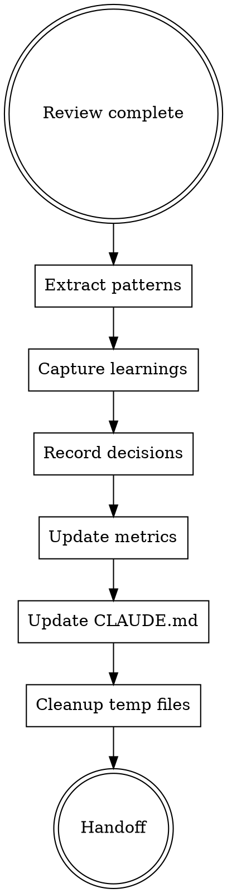

# FORGE Learn

**Phase 9 of 9** - Continuous learning with pattern extraction, knowledge capture, and CLAUDE.md updates.

## Philosophy

**"Knowledge compounds"** - Each workflow makes future work easier. Extract patterns, capture learnings, update documentation.

## When to Use

Use `/forge:learn` when:
- Workflow complete
- Ready to capture learnings
- Want to improve future workflows

## Learn Workflow



## Pattern Extraction

**Archivist agent analyzes:**
1. What patterns were used
2. What novel solutions discovered
3. What anti-patterns avoided
4. What templates emerged

**Writes to:** `.claude/memory/patterns/forge/{category}/{name}.md`

## Learning Capture

**Documents:**
- Problem solved
- Root cause
- Solution applied
- Prevention strategy

**Writes to:** `.claude/memory/learnings/forge/YYYY-MM-DD-{objective}.md`

## Decision Capture

**Records:**
- Architecture decisions made
- Alternatives considered
- Rationale for choices
- Consequences

**Writes to:** `.claude/memory/decisions/forge/ADR-{NNN}-{name}.md`

## CLAUDE.md Auto-Update

**Using `claude-md-management` skill:**

```typescript
Skill:claude-md-management:revise-claude-md
```

**Updates:**
- New patterns discovered
- Updated gotchas
- New common tasks
- Refreshed key learnings

## Metrics Update

**Updates:** `.claude/memory/forge/metrics.json`

```json
{
  "workflows_completed": 13,
  "by_phase": {
    "brainstorm": { "avg_duration": 6 },
    "research": { "avg_duration": 9 },
    "design": { "avg_duration": 16 },
    "plan": { "avg_duration": 11 },
    "build": { "avg_duration": 26 },
    "test": { "avg_duration": 13 },
    "validate": { "avg_duration": 9 },
    "review": { "avg_duration": 16 },
    "learn": { "avg_duration": 5 }
  },
  "patterns_extracted": 24,
  "learnings_captured": 19,
  "tests_pass_rate": 0.95,
  "karpathy_violations": 2
}
```

## Cleanup

**After learning captured:**

**Delete:**
- `.claude/memory/forge/brainstorm/*.md`
- `.claude/memory/forge/debate/*.md`
- `.claude/memory/forge/completed/*.md`
- `.claude/memory/forge/test-*.md`
- `.claude/memory/forge/reviews/*.md`

**Keep:**
- `docs/forge/*.md` (per artifact level)
- `.claude/memory/patterns/`
- `.claude/memory/learnings/`
- `.claude/memory/decisions/`

## Learn Output Format

```markdown
---
date: YYYY-MM-DD
objective: "Fix text rendering in recognition phase"
status: completed
phases_used: 8
time_total: 95min
---

# Learning Summary

## Patterns Extracted
- [Pattern name] → `.claude/memory/patterns/forge/frontend/pattern-name.md`

## Learnings Captured
- [Learning] → `.claude/memory/learnings/forge/YYYY-MM-DD-objective.md`

## Decisions Recorded
- [Decision] → `.claude/memory/decisions/forge/ADR-001-decision.md`

## CLAUDE.md Updated
- Added: [what was added]
- Updated: [what was updated]

## Metrics
- Time per phase: [breakdown]
- Tests pass rate: 95%
- Karpathy violations: 2 (minor)

## Workflow Improvements
Suggestions for next time:
- [Improvement 1]
- [Improvement 2]

## Compounding Effect
This solution will make future similar tasks [X minutes] faster.
```

## Compounding Principle

```
First occurrence:  Research + solve + document (95 min)
Second occurrence: Search memory + apply (10 min)
Third occurrence:  Pattern already known (2 min)

Knowledge compounds. Each workflow makes subsequent workflows easier.
```

## Integration

**Consumes:**
- All phase outputs
- `docs/forge/review.md`

**Produces:**
- Patterns in `.claude/memory/patterns/`
- Learnings in `.claude/memory/learnings/`
- Decisions in `.claude/memory/decisions/`
- Updated CLAUDE.md
- Updated metrics

**Hands off to:**
- Workflow complete
- Knowledge available for future workflows

## Artifact Levels

| Level | Learning Depth |
|-------|----------------|
| Minimal | Basic metrics only |
| Intelligent | Patterns + Learnings + Metrics |
| Maximal | All + CLAUDE.md updates + workflow improvements |
