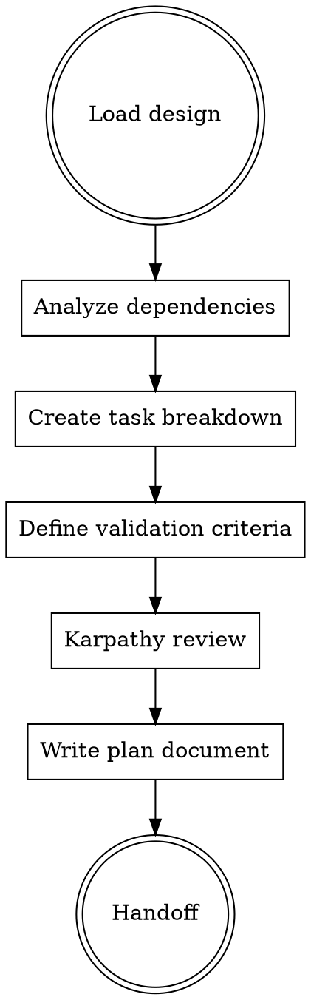

# FORGE Plan

**Phase 4 of 9** - Surgical implementation planning with TDD discipline and Karpathy guideline enforcement.

## Philosophy

**"Plan with precision"** - Detailed, bite-sized tasks with exact file paths, complete code, and TDD strategy.

## When to Use

Use `/forge:plan` when:
- Design specifications exist
- Implementation ready to begin
- Need detailed task breakdown
- Multiple developers may work on feature

Skip when:
- Task is trivial (< 50 lines, single file)
- Use `/forge:quick` instead

## Planning Workflow



## Superpowers Planning Pattern

**Bite-sized task granularity:**
- Each step: 2-5 minutes
- Each task: Independent where possible
- Each task: Has exact file paths
- Each task: Complete code included
- Each task: TDD strategy defined

**Task structure:**
```
Task N: [Component Name]
├── Files (exact paths)
├── Steps (numbered)
├── Code (complete)
├── Tests (strategy)
└── Validation (exit criteria)
```

## Karpathy Guidelines Enforcement

**During planning:**
- "Simpler is better" - Minimize tasks, minimize scope
- "Surgical precision" - Exact line ranges specified
- "One logical change" - Each task = one logical change
- "Changed lines < 50" - Warn if task exceeds
- "Evidence before assertions" - Validation criteria required

## Plan Output Format

```markdown
---
date: YYYY-MM-DD
based_on: "docs/forge/design.md"
artifact_level: intelligent
estimated_duration: 2h
---

# Plan: [Objective]

> **Execution:** FORGE Build phase (`/forge:build`) implements this plan using subagent-driven development.

**Goal:** [One sentence]

**Architecture:** [2-3 sentences]

**Tech Stack:** React 19, TypeScript, Tailwind CSS, Hono

---

## Dependencies

**Files to read first:**
- `src/components/ExistingComponent.tsx` (pattern to follow)
- `src/lib/utils.ts` (helpers)

**Files that will be modified:**
- `src/components/NewComponent.tsx`
- `src/lib/api.ts`

**Tests to write:**
- `src/components/__tests__/NewComponent.test.tsx`

---

## Task 1: Create Component Structure

**Files:**
- Create: `src/components/NewComponent/index.tsx`
- Create: `src/components/NewComponent/types.ts`

**Step 1: Write the failing test**

```typescript
// src/components/__tests__/NewComponent.test.tsx
import { render, screen } from '@testing-library/react';
import { NewComponent } from '../NewComponent';

describe('NewComponent', () => {
  it('renders with required props', () => {
    render(<NewComponent title="Test" />);
    expect(screen.getByText('Test')).toBeInTheDocument();
  });
});
```

**Step 2: Run test to verify it fails**

Run: `npm test -- NewComponent.test.tsx`
Expected: FAIL - "NewComponent not defined"

**Step 3: Write minimal implementation**

```typescript
// src/components/NewComponent/index.tsx
export interface NewComponentProps {
  title: string;
}

export function NewComponent({ title }: NewComponentProps) {
  return <div>{title}</div>;
}
```

**Step 4: Run test to verify it passes**

Run: `npm test -- NewComponent.test.tsx`
Expected: PASS

**Step 5: Commit**

```bash
git add src/components/NewComponent/ src/components/__tests__/
git commit -m "feat: add NewComponent with basic structure"
```

**Validation:**
- [ ] Test passes
- [ ] Component renders
- [ ] TypeScript compiles

---

## Task 2: Add Styling

**Files:**
- Modify: `src/components/NewComponent/index.tsx:10-15`

**Step 1: Update component with Tailwind classes**

```typescript
export function NewComponent({ title }: NewComponentProps) {
  return (
    <div className="bg-paper-base p-6 rounded-lg shadow-md">
      <h2 className="font-serif text-xl text-ink-black">{title}</h2>
    </div>
  );
}
```

**Step 2: Verify visually**

Run: `npm run dev`
Check: Component renders with correct styling

**Step 3: Commit**

```bash
git add src/components/NewComponent/index.tsx
git commit -m "style: add Tailwind styling to NewComponent"
```

**Validation:**
- [ ] Design specs match
- [ ] Responsive behavior correct
- [ ] No visual regressions

---

## Implementation Readiness Check

Before `/forge:build`:
- [ ] All tasks have exact file paths
- [ ] Each task < 50 lines change
- [ ] TDD strategy defined
- [ ] Validation criteria clear
- [ ] No scope creep
- [ ] Dependencies mapped

## Next Phase
→ `/forge:build` to execute plan

## Execution Options

**Option 1: Subagent-Driven (this session)**
- Fresh subagent per task
- Two-stage review (spec + quality)
- Fast iteration

**Option 2: Parallel Session (separate)**
- New session with `/forge:build`
- Batch execution with checkpoints
```

## Karpathy Pre-Flight Check

Before finalizing plan, verify:

| Guideline | Check |
|-----------|-------|
| Simpler is better | Can any tasks be combined? |
| Surgical precision | Are line ranges exact? |
| One logical change | Does each task = one change? |
| Lines < 50 | Any tasks need splitting? |
| Evidence required | Is validation defined? |

## Integration

**Consumes:**
- `docs/forge/design.md` (specifications)
- `docs/forge/research.md` (patterns)

**Produces:**
- `docs/forge/plan.md` (implementation plan with test strategy)

**Hands off to:**
- `/forge:test` - Tests are created BEFORE building (test-first workflow)
- Tests defined in plan guide test creation
- `/forge:build` - Plan executed after tests exist

## Artifact Levels

| Level | Plan Detail |
|-------|-------------|
| Minimal | High-level tasks only |
| Intelligent | Bite-sized with TDD (recommended) |
| Maximal | Extended with edge cases, rollback plans |
