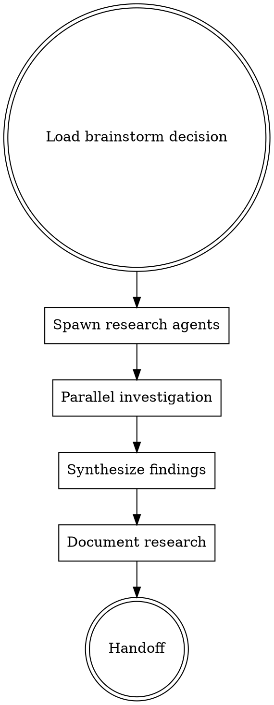

# FORGE Research

## ⚠️ AO Mode Compatibility

**CRITICAL:** This skill contains `Task({subagent_type:...})` examples that spawn internal subagents. In AO mode, this is FORBIDDEN.

### AO Mode Behavior
When `AO_SESSION` environment variable is set:
1. **DO NOT** spawn internal subagents with `Task()`
2. Instead, generate an AO spawn plan
3. Output `ao spawn` commands for each research agent
4. AO will spawn sessions externally
5. Synthesize findings from files written by external sessions

### Example: AO Mode Research Plan
```bash
# Generate AO spawn commands for parallel research
ao spawn <project> "FORGE Research: Analyze codebase patterns for feature X"
ao spawn <project> "FORGE Research: Research best practices for approach Y"
ao spawn <project> "FORGE Research: Gather framework documentation"
```

### Standalone Mode (Not for AO)
The `Task({subagent_type:...})` examples below are for standalone mode only and must NOT be used in AO sessions.

---

**Phase 2 of 9** - BMAD-inspired parallel research with best practices discovery.

## Philosophy

**"Research before deciding"** - Parallel subagents investigate patterns, best practices, and similar implementations before design begins.

## When to Use

Use `/forge:research` when:
- Approach selected from brainstorm needs validation
- Need to discover best practices for implementation
- Similar implementations exist in codebase or ecosystem
- Technology choices need investigation

Skip when:
- Pattern is well-established in codebase
- Technology is familiar and documented
- Time-constrained (use `/forge:design` directly)

## BMAD Parallel Research Pattern



## Research Agents (Parallel)

**Using compound-engineering research agents:**

| Agent | Subagent Type | Focus | Investigates |
|-------|---------------|-------|--------------|
| `repo-researcher` | `repo-research-analyst` | Code patterns | Similar implementations in codebase |
| `best-practices-researcher` | `best-practices-researcher` | Industry standards | Best practices for chosen approach |
| `framework-researcher` | `framework-docs-researcher` | Documentation | Framework docs, API references |
| `git-history-researcher` | `git-history-analyzer` | Evolution | Code archaeology, past decisions |

**Agent Invocation:**

```javascript
// Repository pattern analysis
Task({
  subagent_type: "compound-engineering:research:repo-research-analyst",
  description: "Analyze codebase patterns",
  prompt: "Analyze the codebase for patterns relevant to: [selected approach]. Find similar implementations, established conventions, and architectural patterns. Write findings to .claude/memory/forge/research/repo-patterns.md"
})

// Best practices research
Task({
  subagent_type: "compound-engineering:research:best-practices-researcher",
  description: "Research industry best practices",
  prompt: "Research current best practices for: [selected approach]. Include implementation patterns, common pitfalls, performance considerations, and community standards. Write findings to .claude/memory/forge/research/best-practices.md"
})

// Framework documentation
Task({
  subagent_type: "compound-engineering:research:framework-docs-researcher",
  description: "Gather framework documentation",
  prompt: "Gather comprehensive documentation about the frameworks/libraries relevant to: [selected approach]. Include official docs, key APIs, and version-specific notes. Write findings to .claude/memory/forge/research/framework-docs.md"
})

// Git history analysis
Task({
  subagent_type: "compound-engineering:research:git-history-analyzer",
  description: "Analyze code evolution",
  prompt: "Analyze git history for files/components related to: [selected approach]. Understand past decisions, refactoring patterns, and evolution. Write findings to .claude/memory/forge/research/git-history.md"
})
```

## Research Protocol

**Each agent:**
1. Reads brainstorm decision (selected approach)
2. Investigates their focus area independently
3. Documents findings with sources
4. **Writes to `.claude/memory/forge/research/{agent}.md`**
5. **Stops - file write is completion signal**

## Synthesis

After all agents complete, synthesizer:
1. Reads all research outputs
2. Identifies conflicts between findings
3. Resolves with evidence-based selection
4. **Writes synthesized research to `docs/forge/research.md`**

## Research Output Format

```markdown
---
date: YYYY-MM-DD
based_on: "docs/forge/brainstorm.md"
artifact_level: intelligent
---

# Research: [Objective]

## Approach Being Validated
[Summary from brainstorm decision]

## Codebase Patterns

### Similar Implementations Found
| Location | Pattern | Relevance |
|----------|---------|-----------|
| `src/components/X.tsx` | [Pattern] | High - same use case |
| `src/lib/Y.ts` | [Pattern] | Medium - similar approach |

### Established Conventions
- [Convention 1 from CLAUDE.md]
- [Convention 2 from codebase]

## Best Practices Discovered

### Industry Standards
- [Source: documentation/blog]
  - Practice: [description]
  - Rationale: [why]
  - Applicability: [to our use case]

### Community Patterns
- [Source: GitHub/open source]
  - Pattern: [description]
  - Trade-offs: [pros/cons]

## Ecosystem Research

### Relevant Libraries
| Library | Purpose | Pros | Cons |
|---------|---------|------|------|
| [lib-name] | [purpose] | [pros] | [cons] |

### Tooling
- [Tool recommendations]

## Risks and Pitfalls

### Known Issues
- [Issue 1]: [Description and mitigation]
- [Issue 2]: [Description and mitigation]

### Anti-Patterns to Avoid
- [Anti-pattern 1]: [Why it's bad, what to do instead]

## Research Conclusions

### Validated Assumptions
- [Assumption 1]: ✅ Confirmed by [source]
- [Assumption 2]: ⚠️ Partial - [nuance]

### New Discoveries
- [Discovery that affects approach]

### Recommendations for Design
1. [Specific recommendation]
2. [Specific recommendation]

## References
- [Link 1]
- [Link 2]

## Next Phase
→ `/forge:design` to create UI/UX specifications
```

## Integration

**Auto-loads:**
- `forge-context` - Loads brainstorm decision
- Context7 MCP - Documentation lookup for libraries

**Consumes:**
- `docs/forge/brainstorm.md` (selected approach)

**Produces:**
- `docs/forge/research.md` (validated patterns)

**Hands off to:**
- `/forge:design` - Research informs design decisions

## Artifact Levels

| Level | Research Depth |
|-------|----------------|
| Minimal | Skip research, proceed to design |
| Intelligent | 3-4 parallel agents, standard depth |
| Maximal | Extended research, external sources, prototypes |

## Timeboxing

Default timeouts per artifact level:
- Intelligent: 5 minutes per agent
- Maximal: 10 minutes per agent

## Success Criteria

Research is complete when:
- [ ] Multiple angles investigated in parallel
- [ ] Codebase patterns documented
- [ ] Best practices discovered with sources
- [ ] Risks identified with mitigations
- [ ] Clear recommendations for design phase
