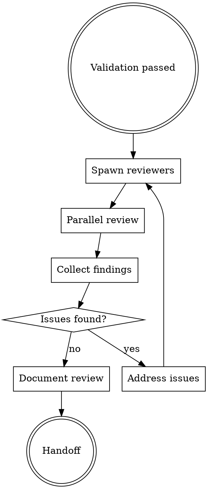

# FORGE Review

## ⚠️ AO Mode Compatibility

**CRITICAL:** This skill contains `Task({subagent_type:...})` examples that spawn internal subagents. In AO mode, this is FORBIDDEN.

### AO Mode Behavior
When `AO_SESSION` environment variable is set:
1. **DO NOT** spawn internal subagents with `Task()`
2. Instead, generate an AO spawn plan
3. Output `ao spawn` commands for each reviewer role
4. AO will spawn sessions externally
5. Collect results from files written by external sessions

### Example: AO Mode Review Plan
```bash
# Generate AO spawn commands for parallel reviewers
ao spawn <project> "FORGE Review: Security audit for PR #123"
ao spawn <project> "FORGE Review: Performance analysis for PR #123"
ao spawn <project> "FORGE Review: Architecture compliance for PR #123"
```

### Standalone Mode (Not for AO)
The `Task({subagent_type:...})` examples below are for standalone mode only and must NOT be used in AO sessions.

---

**Phase 8 of 9** - Comprehensive code review with parallel specialized reviewers and Karpathy focus.

## Philosophy

**"Review with rigor"** - Multiple specialized reviewers examine code from different angles in parallel.

## When to Use

Use `/forge:review` when:
- Validation passed
- Code ready for final review
- Quality assurance required

Skip when:
- Skipping review phase (configured)
- Solo project with self-review

## Review Workflow



## Parallel Reviewers

**Using compound-engineering agents:**

| Reviewer | Agent | Focus | Checks |
|----------|-------|-------|--------|
| `karpathy-reviewer` | `code-simplicity-reviewer` | Surgical precision | Lines < 50, one change, no scope creep |
| `performance-reviewer` | `performance-oracle` | Speed | Bundle size, render perf, queries |
| `security-reviewer` | `security-sentinel` | Security | Auth, injection, exposure |
| `architecture-reviewer` | `architecture-strategist` | Architecture | SOLID, patterns, boundaries |
| `pattern-reviewer` | `pattern-recognition-specialist` | Consistency | Patterns, anti-patterns |

**Agent Invocation:**

```javascript
// Security review (critical for all PRs)
Task({
  subagent_type: "compound-engineering:review:security-sentinel",
  description: "Security audit",
  prompt: "Perform comprehensive security audit on the changes. Check for: secrets in code, injection vulnerabilities, auth issues, data exposure. Write findings to .claude/memory/forge/review/security.md"
})

// Performance review
Task({
  subagent_type: "compound-engineering:review:performance-oracle",
  description: "Performance analysis",
  prompt: "Analyze code for performance bottlenecks, N+1 queries, memory leaks, bundle size impact. Write findings to .claude/memory/forge/review/performance.md"
})

// Architecture review
Task({
  subagent_type: "compound-engineering:review:architecture-strategist",
  description: "Architecture compliance",
  prompt: "Review code for architectural compliance: SOLID principles, separation of concerns, design patterns. Write findings to .claude/memory/forge/review/architecture.md"
})

// Code simplicity (Karpathy guidelines)
Task({
  subagent_type: "compound-engineering:review:code-simplicity-reviewer",
  description: "Simplicity and YAGNI check",
  prompt: "Review code for YAGNI violations, unnecessary complexity, over-engineering. Ensure Karpathy guidelines followed. Write findings to .claude/memory/forge/review/simplicity.md"
})

// Pattern analysis
Task({
  subagent_type: "compound-engineering:research:pattern-recognition-specialist",
  description: "Pattern and anti-pattern detection",
  prompt: "Analyze code for design patterns and anti-patterns. Check naming conventions, duplication, consistency with codebase. Write findings to .claude/memory/forge/review/patterns.md"
})
```

## Karpathy Reviewer (Critical)

**From SLFG workflow - Karpathy Guidelines:**

```
You are a surgical code reviewer. Your job is to ensure every edit:
1. Touches minimum lines necessary
2. Does one thing only
3. Doesn't refactor "while I'm here"
4. Has evidence it works
5. Can be explained in one sentence

REJECT any edit that:
- Changes >50 lines
- Mixes concerns
- Refactors unrelated code
- Lacks test evidence
```

## Review Output Format

```markdown
---
date: YYYY-MM-DD
validation_ref: "docs/forge/validation.md"
status: approved
---

# Code Review

## Reviewers
- karpathy-reviewer
- design-reviewer
- performance-reviewer

## Karpathy Review

| Criterion | Status | Notes |
|-----------|--------|-------|
| Lines < 50 | ✅ | Max 23 lines |
| One change | ✅ | Each task focused |
| No scope creep | ✅ | No unrelated changes |
| Evidence | ✅ | Tests pass |

**Verdict:** ✅ Approved

## Design Review

| Aspect | Status | Notes |
|--------|--------|-------|
| Design system | ✅ | Colors correct |
| Animations | ✅ | Smooth transitions |
| Responsive | ✅ | Breakpoints work |

**Verdict:** ✅ Approved

## Performance Review

| Metric | Before | After | Status |
|--------|--------|-------|--------|
| Bundle size | 1.1 MB | 1.2 MB | ⚠️ +100KB |
| First render | 120ms | 125ms | ✅ |
| API calls | 3 | 3 | ✅ |

**Verdict:** ✅ Approved (size increase justified)

## Security Review (Critical for PRs)

**Security Reviewer Agent checks:**

| Category | Checks |
|----------|--------|
| **Secrets** | No API keys, tokens, passwords in code |
| **Injection** | SQL, XSS, command injection prevention |
| **Auth** | Proper authentication/authorization checks |
| **Data Exposure** | No PII, sensitive data in logs/responses |
| **Dependencies** | No vulnerable packages (if applicable) |
| **CORS** | Correct CORS configuration |

**Security Review Output:**
```markdown
## Security Review

| Check | Status | Notes |
|-------|--------|-------|
| Secrets in code | ✅ PASS | No hardcoded credentials |
| Input validation | ✅ PASS | All inputs sanitized |
| Auth checks | ✅ PASS | Protected routes verified |
| Data exposure | ✅ PASS | No sensitive data leaked |
| Injection risks | ✅ PASS | Prepared statements used |

**Verdict:** ✅ Approved for merge
```

**If security issues found:**
- BLOCK merge until resolved
- Document in review.md
- Assign fix to builder agent
- Re-review after fix

## Overall

**Status:** ✅ Approved

**Required actions:** None

**Optional improvements:**
- Consider lazy loading for new component

## Next Phase
→ `/forge:learn` to capture patterns
```

## Approval Criteria

All reviewers must approve:
- [ ] Karpathy guidelines followed
- [ ] Design system compliant
- [ ] Performance acceptable
- [ ] Security reviewed
- [ ] Tests passing (evidence)

## Integration

**Consumes:**
- `docs/forge/validation.md`
- Implemented code

**Produces:**
- `docs/forge/review.md`

**Hands off to:**
- `/forge:learn` - Review complete, capture learnings

## Artifact Levels

| Level | Review Depth |
|-------|--------------|
| Minimal | Karpathy only |
| Intelligent | Karpathy + Design + Performance |
| Maximal | All + Security + Accessibility |
