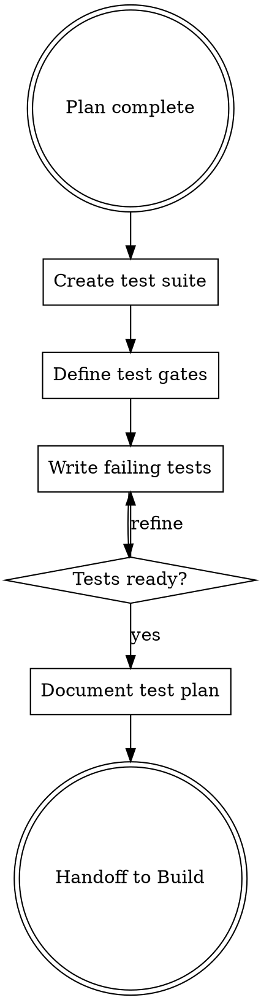

# FORGE Test

**Phase 5 of 9** (after Plan, before Build) - **Create tests BEFORE building.** This is test-first at the workflow level.

## Philosophy

**"Test like your success depends on it - because it does"** - This is not a quick check, it's a comprehensive test suite phase. Multiple testing angles, coverage requirements, regression prevention, evidence-based results.

## When to Use

Use `/forge:test` when:
- Plan phase complete (test strategy defined)
- Ready to create tests BEFORE building
- Want test-first workflow

**Why before Build?**
- Tests define "done" before coding starts
- Ralph Loop iterates against these tests
- Prevents false success declarations
- Ensures test coverage from the start

Skip when:
- No tests in project
- Using `/forge:ralph` (tests created during iteration)

## Test-First Workflow (Before Build)



**Test Gates for Ralph Loop:**
- **Minor Gates:** Unit tests, type checks (run frequently)
- **Full Gates:** Integration tests, E2E tests (run before commit)

## Parallel Testing Agents

| Agent | Focus | Runs |
|-------|-------|------|
| `unit-test-agent` | Unit tests | `npm test` |
| `type-check-agent` | TypeScript | `tsc --noEmit` |
| `browser-test-agent` | Visual/UI | Playwright MCP |
| `integration-agent` | Integration | API/data flow |

## Unit Test Agent

**Responsibilities:**
- Run `npm test`
- Measure coverage
- Report failures with context
- Suggest missing tests

**Output:** `.claude/memory/forge/test-unit.md`

## Type Check Agent

**Responsibilities:**
- Run `npx tsc --noEmit`
- Report type errors
- Fix or flag issues

**Output:** `.claude/memory/forge/test-types.md`

## Browser Test Agent

**Responsibilities:**
- Use Playwright MCP
- Screenshot affected pages
- Compare before/after
- Report visual regressions

**Output:** `.claude/memory/forge/test-browser.md`

## Integration Test Agent

**Responsibilities:**
- Test full user flows
- Validate data flow
- Check state management
- API integration

**Output:** `.claude/memory/forge/test-integration.md`

## Test Results Format

```markdown
---
date: YYYY-MM-DD
build_ref: "[build session]"
---

# Test Results

## Summary
| Category | Status | Coverage |
|----------|--------|----------|
| Unit | ✅ Pass | 87% |
| Type | ✅ Pass | - |
| Browser | ⚠️ Partial | N/A |
| Integration | ✅ Pass | - |

## Unit Tests

### ✅ Passing (42)
- `NewComponent.test.tsx` - All tests pass

### ❌ Failing (2)
- `OldComponent.test.tsx:45` - "Expected true, got false"
  - Context: [explanation]
  - Suggested fix: [recommendation]

## TypeScript

✅ No errors

## Browser Tests

### Screenshots
| Page | Before | After | Status |
|------|--------|-------|--------|
| /dashboard | [img] | [img] | ✅ |
| /profile | [img] | [img] | ⚠️ Layout shift |

### Visual Regressions
- Profile page: Card padding increased 4px

## Integration Tests

✅ All flows pass:
- Login → Dashboard
- Create item → View item
- Edit profile → Save

## Recommendations

1. Fix `OldComponent.test.tsx` before proceeding
2. Profile page layout shift acceptable

## Next Phase
→ `/forge:validate` to verify against requirements
```

## Comprehensive Test Suite Requirements

**This phase creates tests, not just runs them.**

### Test Suite Creation (If Missing)

**Unit Test Suite:**
- Component rendering tests
- Props validation tests
- State change tests
- Event handler tests
- Edge case tests

**Integration Test Suite:**
- API integration tests
- Data flow tests
- State management tests
- Cross-component tests

**E2E Test Suite:**
- Critical user flows
- Authentication flows
- Payment flows (if applicable)
- Error recovery flows

### Test Quality Requirements

| Aspect | Requirement |
|--------|-------------|
| Independence | Each test isolated, no shared state |
| Determinism | Same input = same output |
| Speed | Tests complete in < 30s total |
| Clarity | Test name describes what's tested |
| Coverage | All critical paths covered |

### Coverage Thresholds

| Level | Required Coverage |
|-------|-------------------|
| Minimal | No requirement |
| Intelligent | 70% |
| Maximal | 85% |

### Regression Prevention

**Browser Tests:**
- Screenshot comparison (before/after)
- Visual regression detection
- Responsive breakpoint testing
- Animation behavior verification

**Performance Tests:**
- Bundle size monitoring
- Render time benchmarks
- API response time checks
- Memory leak detection

## Test Failure Protocol

**When tests fail:**
1. HALT - Do not proceed
2. Analyze - Debug agent investigates
3. Fix - Address root cause
4. Verify - Re-run all tests
5. Document - Note fix in test results

## Integration

**Consumes:**
- `docs/forge/plan.md` (test strategy defined in plan)

**Produces:**
- Test suite files (ready for build phase)
- `docs/forge/test-plan.md` (test specifications)
- Test gates (minor and full)

**Hands off to:**
- `/forge:build` or `/forge:ralph` - Tests exist, iterate until passing
- Build uses Ralph Loop with tests as completion criteria

## Ralph Loop Integration

**How tests enable Ralph Loop:**

```
Plan → Test Creation → Ralph Loop (iterate until tests pass) → Validate
         ↑                    ↓
    Define test gates    Run minor gates frequently
    Define full gates    Run full gates before commit
```

**Test Gates:**
| Gate Type | Tests | When Run |
|-----------|-------|----------|
| **Minor Gates** | Unit tests, type checks | Every Ralph iteration |
| **Full Gates** | Integration, E2E | Before final commit |

**Example Ralph Command:**
```bash
/forge:ralph "Implement feature from plan" \
  --plan docs/forge/plan.md \
  --test-plan docs/forge/test-plan.md \
  --completion-promise "MINOR GATES PASS: All unit tests green, TypeScript clean" \
  --final-gate "FULL GATES PASS: Integration tests pass, E2E complete"
```

## Artifact Levels

| Level | Test Depth |
|-------|------------|
| Minimal | Unit tests only |
| Intelligent | Unit + Type + Browser |
| Maximal | All + coverage + performance |
