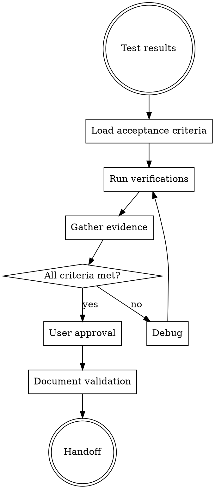

# FORGE Validate

**Phase 7 of 9** - Quality gates with evidence-based validation against acceptance criteria.

## Philosophy

**"Verify before claiming"** - No completion without evidence. Run verification commands, read output, confirm claim.

## When to Use

Use `/forge:validate` when:
- Test phase complete
- Need to verify against requirements
- Quality gates enabled

Skip when:
- Skipping quality gates (configured)
- Direct to review

## Validation Workflow



## Evidence Before Claims

**Critical requirement - Evidence Before Claims:**

Before claiming completion, you MUST:
1. Run full verification commands (fresh, complete)
2. Read full output, check exit codes
3. Confirm output validates the claim
4. State claim WITH evidence

## Validation Agents

| Agent | Focus | Validates |
|-------|-------|-----------|
| `functional-validator` | Requirements | Acceptance criteria |
| `karpathy-validator` | Guidelines | Surgical precision |
| `design-validator` | UI/UX | Design specs |

## Required Verifications

```bash
# TypeScript check
cd frontend && npx tsc --noEmit

# Test run
npm test

# Build check (if applicable)
npm run build

# Lint check (if configured)
npm run lint
```

## Validation Output Format

```markdown
---
date: YYYY-MM-DD
test_ref: "docs/forge/test-results.md"
status: validated
---

# Validation Report

## Acceptance Criteria

From brainstorm/plan:

| Criterion | Status | Evidence |
|-----------|--------|----------|
| Component renders title | ✅ | Screenshot, test passes |
| Responsive layout | ✅ | Browser test at 3 widths |
| Accessibility compliant | ✅ | a11y audit pass |

## Evidence

### TypeScript
```
$ npx tsc --noEmit
✅ No errors found
```

### Tests
```
$ npm test
Test Suites: 12 passed, 12 total
Tests:       47 passed, 47 total
```

### Build
```
$ npm run build
✓ 124 modules transformed.
dist/                     1.2 MB
```

### Screenshots
| View | Evidence |
|------|----------|
| Desktop | [screenshot] |
| Mobile | [screenshot] |

## Karpathy Compliance

| Guideline | Evidence |
|-----------|----------|
| Lines < 50 | Max 23 lines per edit |
| One change | Each task single purpose |
| No scope creep | Only planned changes |

## User Approval

**Presented to user:** YYYY-MM-DD
**Approved:** ✅ / ❌
**Notes:** [user feedback]

## Next Phase
→ `/forge:review` for final code review
```

## Validation Checklist

- [ ] TypeScript compiles (evidence: command output)
- [ ] Tests pass (evidence: test output)
- [ ] Design review passed (evidence: review doc)
- [ ] No scope creep (evidence: diff stats)
- [ ] Screenshots for UI (evidence: images)
- [ ] Karpathy guidelines followed

## Integration

**Consumes:**
- `docs/forge/test-results.md`
- `docs/forge/plan.md` (acceptance criteria)

**Produces:**
- `docs/forge/validation.md`

**Hands off to:**
- `/forge:review` - Validation complete, ready for review

## Artifact Levels

| Level | Validation Depth |
|-------|------------------|
| Minimal | Basic checks only |
| Intelligent | Full criteria + evidence |
| Maximal | Extended + user approval gate |
